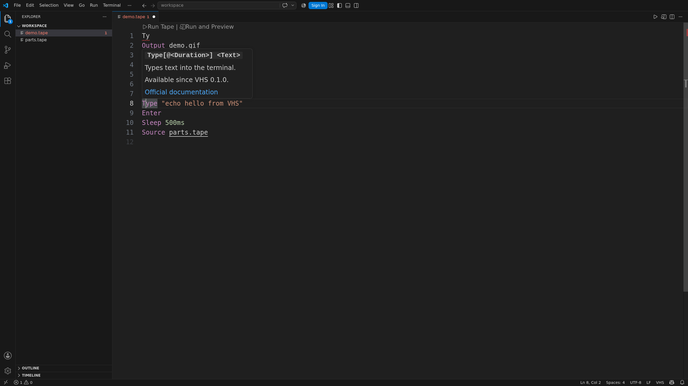
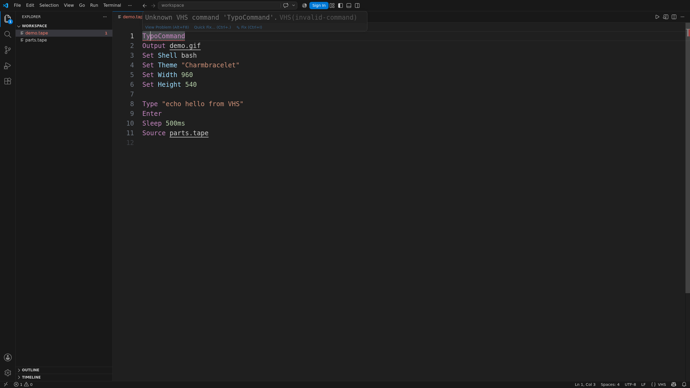

Completion covers commands, settings, shells, themes, key combinations, and values. Hover shows
syntax, defaults, version support, and documentation.

Built-in checks catch bad commands, values, durations, paths, output conflicts, late settings, and
unsupported commands. Formatting follows VHS syntax and is safe to run more than once.

