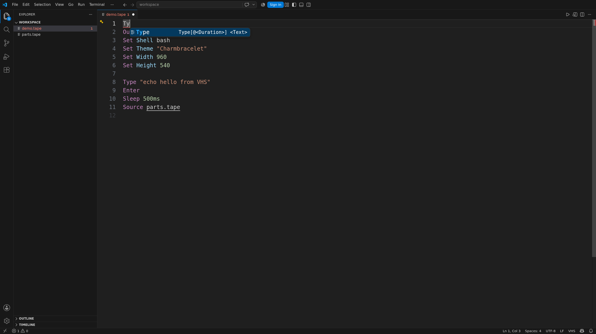

Get highlighting, completion, hover help, checks, formatting, source navigation, and artifact
previews for `.tape` files.

VHS itself is optional for editing. Install it when you want to run or validate tapes.
